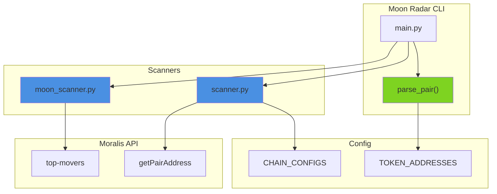

# RATU Moon Radar

[Python 3.10+](https://www.python.org/downloads/) | [uv](https://github.com/astral-sh/uv) | [RATUProject](https://github.com/adityonugrohoid)

Multi-chain DEX pair scanner and early token detector using the Moralis API.


## Production Readiness

**Level: POC**

This system demonstrates prototyping-focused blockchain integration with:
- **Multi-chain support** across Ethereum, BNB Chain, Polygon, Base
- **Dynamic pair parsing** with flexible input formats
- **Connection pooling** for reduced API latency
- **Type-safe dataclass results** for structured output

> **System Prototyping Focus**: Real-time token discovery with connection pooling and multi-chain support

## Part of RATUProject

This repository is part of **RATUProject** (Real-time Automated Trading Unified) - an open-source portfolio demonstrating real-time, event-driven system design for financial markets and blockchain integrations.

## Features

| Feature | Description |
|---------|-------------|
| **DEX Pair Scanner** | Discover any token pair liquidity pools across major chains |
| **Dynamic Pair Selection** | Scan any pair via CLI: `ethusdt`, `wbtcusdc`, `bnbusdt` |
| **Moon Token Scanner** | Detect tokens with biggest 24h price gains |
| **Multi-Chain** | Ethereum, BNB Chain, Polygon, Base |

## System Overview



## Usage

```bash
# Sync dependencies
uv sync

# Configure API key
cp .env.example .env
# Edit .env and add your MORALIS_API_KEY

# DEX Pair Scanner (default: ETH/USDT)
uv run moon-radar

# Dynamic pair selection
uv run moon-radar ethusdt      # ETH/USDT
uv run moon-radar wbtcusdc     # WBTC/USDC
uv run moon-radar bnbusdt      # BNB/USDT
uv run moon-radar eth/usdt     # Separator also works

# Moon Token Scanner (top gainers)
uv run moon-radar moon eth

# Help
uv run moon-radar help
```

### Sample Output - DEX Pairs

```
MOON RADAR - Multi-Chain DEX Pair Scanner
======================================================================
  Target pair: ETH/USDT
  ------------------------------------------------------------------
  Chain        Pair         Exchange        Pair Address
  ------------------------------------------------------------------
  Ethereum     ETH/USDT     uniswapv2       0xb4e16d0168e52d35...
  BNB Chain    ETH/USDT     pancakeswapv2   0xd99c7f6c65857ac9...
  Polygon      ETH/USDT     quickswap       0x7baf833f82bb1971...
```

### Sample Output - Moon Tokens

```
MOON RADAR - Early Token Scanner (Top Gainers)
======================================================================
  #   Symbol   Name                 Price        24h %      MCap
  ------------------------------------------------------------------
  1   BAT      Basic Attention...   $0.28        +9.7%      $416M
  2   AAVE     Aave Token           $380.50      +8.0%      $5.7B
```

## Supported Tokens

| Chain | Tokens |
|-------|--------|
| Ethereum | ETH, WETH, USDT, USDC, WBTC, DAI |
| BNB Chain | BNB, WBNB, USDT, USDC, ETH, BTCB |
| Polygon | MATIC, WMATIC, USDT, USDC, WETH, WBTC |
| Base | ETH, WETH, USDC, USDbC |

## Project Structure

```
ratu-moon-radar/
  src/moon_radar/
    __init__.py
    config.py         # Chain configs, token addresses, parse_pair()
    scanner.py        # DEX pair scanner (MoralisClient)
    moon_scanner.py   # Token gainer scanner (MoonScanner)
    main.py           # Entry point with CLI
  tests/
    conftest.py
    test_config.py
    test_scanner.py
```

## Design Decisions

| Decision | Rationale |
|----------|-----------|
| Dynamic pair parsing | Flexible CLI with multiple input formats |
| Token address mapping | Per-chain token lookups |
| httpx connection pool | Reduced API latency |
| Dataclass results | Type-safe structured data |

## Notable Code

This repository demonstrates prototyping-focused blockchain integration patterns. See [NOTABLE_CODE.md](NOTABLE_CODE.md) for detailed code examples highlighting:

- Multi-chain configuration and support
- Dynamic pair parsing with flexible input formats
- Connection pooling for API optimization

## License

This project is licensed under the MIT License - see the [LICENSE](LICENSE) file for details.

## Author

**Adityo Nugroho**  
- Portfolio: https://adityonugrohoid.github.io  
- GitHub: https://github.com/adityonugrohoid  
- LinkedIn: https://www.linkedin.com/in/adityonugrohoid/
