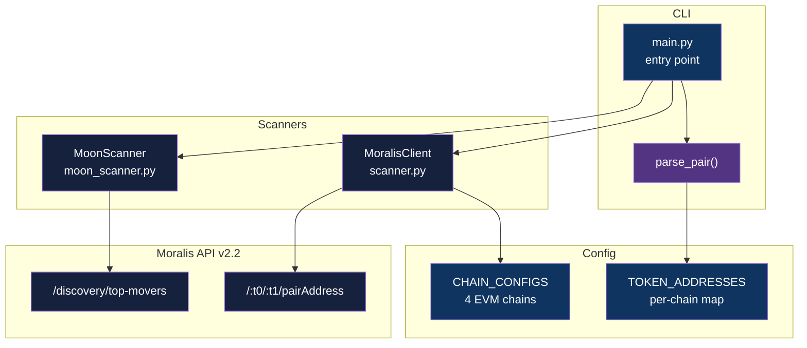

<div align="center">

# RATU Moon Radar

[](https://www.python.org/downloads/)
[](https://docs.astral.sh/uv/)
[](LICENSE)

**Multi-chain DEX pair scanner and trending-token detector via Moralis API across Ethereum, BSC, Polygon, and Base.**

[Getting Started](#getting-started) | [Usage](#usage) | [Architecture](#architecture)

</div>

---

## Table of Contents

- [Features](#features)
- [Tech Stack](#tech-stack)
- [Architecture](#architecture)
- [Getting Started](#getting-started)
  - [Prerequisites](#prerequisites)
  - [Installation](#installation)
  - [Configuration](#configuration)
- [Usage](#usage)
- [How It Works](#how-it-works)
- [Architectural Decisions](#architectural-decisions)
- [Project Structure](#project-structure)
- [Testing](#testing)
- [Related Projects](#related-projects)
- [License](#license)
- [Author](#author)

## Features

- **Multi-chain DEX pair scanner** - discover liquidity pools across Ethereum, BNB Chain, Polygon, and Base in one pass
- **Dynamic pair parsing** - accepts `ethusdt`, `eth/usdt`, `ETH-USDT`, and ~13 other shortcut formats via `parse_pair()`
- **Trending-token detector** - top 24h gainers per chain via the Moralis top-movers endpoint
- **Connection pooling** - `httpx.Client` reuses TCP connections across chain queries to cut latency
- **Rate-limit handling** - exponential backoff on HTTP 429 (`1s -> 2s -> 4s`, up to 3 attempts)
- **Type-safe results** - `PairResult` and `MoonToken` dataclasses for downstream consumption

## Tech Stack

| Component | Technology |
|-----------|------------|
| Language | Python 3.10+ |
| Package manager | `uv` |
| HTTP client | `httpx` (sync, connection-pooled) |
| Data source | Moralis Web3 API v2.2 |
| Chains | Ethereum, BNB Chain, Polygon, Base |
| DEXes | Uniswap V2, PancakeSwap V2, QuickSwap |
| Config | `python-dotenv` |
| Tests | `pytest`, `pytest-asyncio` |

## Architecture



## Getting Started

### Prerequisites

- Python 3.10+
- `uv` - see [install instructions](https://docs.astral.sh/uv/getting-started/installation/)
- A Moralis API key - free tier at [admin.moralis.io](https://admin.moralis.io/)

### Installation

```bash
git clone https://github.com/adityonugrohoid/ratu-moon-radar.git
cd ratu-moon-radar
uv sync
```

### Configuration

```bash
cp .env.example .env
# Edit .env and set MORALIS_API_KEY
```

| Variable | Required | Default | Purpose |
|----------|----------|---------|---------|
| `MORALIS_API_KEY` | Yes | - | Moralis Web3 API key |
| `LOG_LEVEL` | No | `INFO` | Python logging level |

## Usage

```bash
# Default pair (ETH/USDT) across all 4 chains
uv run moon-radar

# Specific pair - separator is optional and case-insensitive
uv run moon-radar wbtcusdc
uv run moon-radar bnb/usdt

# Top 24h gainers on a chain
uv run moon-radar moon eth
uv run moon-radar moon bsc

# Help
uv run moon-radar help
```

### Pair scan output

```
MOON RADAR - Multi-Chain DEX Pair Scanner
======================================================================
  Target pair: ETH/USDT
  ------------------------------------------------------------------
  Chain        Pair         Exchange        Pair Address
  ------------------------------------------------------------------
  Ethereum     ETH/USDT     uniswapv2       0xb4e16d0168e52d35...
  BNB Chain    ETH/USDT     pancakeswapv2   0xd99c7f6c65857ac9...
  Polygon      ETH/USDT     quickswap       0x7baf833f82bb1971...
```

### Top gainers output

```
MOON RADAR - Early Token Scanner (Top Gainers)
======================================================================
  #   Symbol   Name                 Price        24h %      MCap
  ------------------------------------------------------------------
  1   BAT      Basic Attention...   $0.28        +9.7%      $416M
  2   AAVE     Aave Token           $380.50      +8.0%      $5.7B
```

### Supported tokens

| Chain | Tokens |
|-------|--------|
| Ethereum | ETH, WETH, USDT, USDC, WBTC, DAI |
| BNB Chain | BNB, WBNB, USDT, USDC, ETH, BTCB |
| Polygon | MATIC, WMATIC, USDT, USDC, WETH, WBTC |
| Base | ETH, WETH, USDC, USDbC |

## How It Works

### 1. Pair parsing

`parse_pair()` in `src/moon_radar/config.py` accepts arbitrary case and separator combinations, resolving via:

1. Normalize - uppercase, strip `/`, `-`, `_`
2. Match against ~13 known shortcuts (`ETHUSDT -> (ETH, USDT)`, etc.)
3. Right-edge token-boundary detection (`USDT`, `USDC`, `WETH`, `ETH`, `BNB`, `MATIC`, `DAI`)
4. Last-resort midpoint split

### 2. Multi-chain scan

For each entry in `CHAIN_CONFIGS`, the scanner resolves both token addresses for that chain, then calls Moralis `GET /:token0/:token1/pairAddress?chain=...&exchange=...`. Chains where either token is not mapped are skipped silently - partial results are more useful than aborting.

### 3. Resilient HTTP

`MoralisClient` in `src/moon_radar/scanner.py` uses `httpx.Client` for connection reuse and handles four response classes:

| Status | Behavior |
|--------|----------|
| `200` | Return `pairAddress` |
| `404` | Pair not found on this exchange - return `None` |
| `429` | Exponential backoff: `1s -> 2s -> 4s`, up to 3 attempts |
| Timeout | Retry up to `MAX_RETRIES` (3) with `RETRY_DELAY` between attempts |

### 4. Moon scanner

`MoonScanner.get_top_gainers(chain, limit=10)` calls the Moralis top-movers endpoint and returns `MoonToken` dataclasses sorted by 24h % change.

## Architectural Decisions

### 1. `httpx.Client` over `requests`

**Decision:** Use `httpx.Client` with persistent connection pooling.

**Reasoning:** A single CLI run hits four chains back-to-back against the same Moralis host. `requests.Session` would also reuse connections, but `httpx` is forward-compatible with the async client if scan volume grows.

### 2. Per-chain skip on missing token

**Decision:** Silently skip chains where the user-requested token symbol is not in `TOKEN_ADDRESSES[chain]`, rather than fail the whole scan.

**Reasoning:** A user querying `MATIC/USDT` should not see Base flagged as an error - that chain just does not have MATIC. Partial results across the chains where the pair exists are more useful than aborting.

### 3. Token addresses checked into source

**Decision:** Hard-code per-chain token addresses in `config.py` instead of resolving on every call.

**Reasoning:** Token contract addresses are immutable once deployed. An on-chain lookup per scan adds latency with no benefit. Trade-off: adding a new token is a code change, not a config change.

## Project Structure

```
ratu-moon-radar/
├── src/moon_radar/
│   ├── main.py             # CLI entry: pair-scan, moon-scan, help
│   ├── config.py           # CHAIN_CONFIGS, TOKEN_ADDRESSES, parse_pair()
│   ├── scanner.py          # MoralisClient + PairResult dataclass
│   └── moon_scanner.py     # MoonScanner + MoonToken dataclass
├── tests/
│   ├── conftest.py
│   ├── test_config.py      # parse_pair shortcuts, separator handling, address resolution
│   ├── test_scanner.py     # MoralisClient headers, retry logic, error mapping
│   └── test_scanner_api.py # Live API contract checks (requires MORALIS_API_KEY)
├── .env.example
└── pyproject.toml          # uv-managed, Python 3.10+
```

## Testing

```bash
uv run pytest tests/ -v
```

| Module | Coverage |
|--------|----------|
| `test_config.py` | `parse_pair` shortcuts, separator handling, address resolution |
| `test_scanner.py` | `MoralisClient` headers, retry logic, error mapping |
| `test_scanner_api.py` | Live API contract checks (requires `MORALIS_API_KEY`) |

## License

This project is licensed under the [MIT License](LICENSE).

## Author

**Adityo Nugroho** ([@adityonugrohoid](https://github.com/adityonugrohoid))
